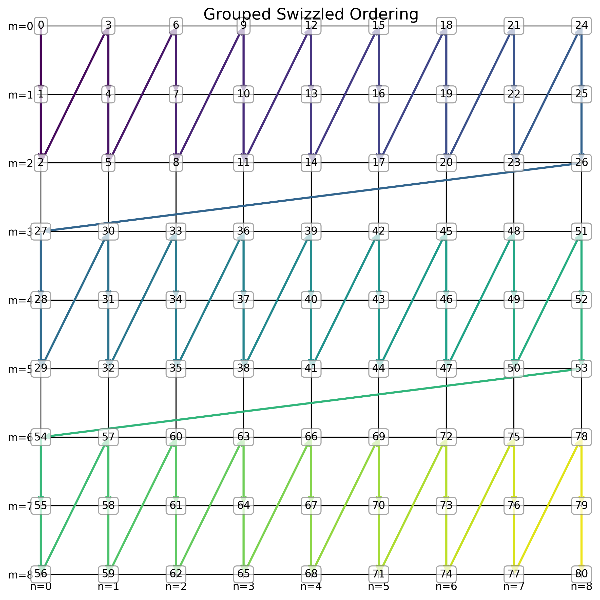

# Triton GEMM: A Step-by-Step Implementation Guide

This tutorial will show you how to write a high performance gemm step by step from zero. We focus here on the core **algorithmic logic of Triton kernels**. Autotuning and compiler optimizations are temporarily beyond our scope; our aim is to write correct kernel logic and push performance as far as Triton’s constrained programming model allows.

## From CUDA to Triton

Looking at the basic CUDA matmul implementation below, we see that CUDA takes a **thread-level** view
```C++
__global__ void matmul(const __fp16* A, const __fp16* B, __fp16* C, int M, int N, int K) {
    int col = blockIdx.x * blockDim.x + threadIdx.x; 
    int row = blockIdx.y * blockDim.y + threadIdx.y;

    if (row < M && col < K) {
        float sum = 0.0f; 
        for (int z = 0; z < N; ++z) {
            sum += A[row * N + z] * B[z * K + col];
        }
        C[row * K + col] = sum; 
    }
}
```


whereas Triton naturally adopts a **workgroup-level**  perspective.
```python
# triton
pid = tl.program_id(axis=0)
```
is equivalent to

```C++
// cuda
int pid = blockIdx.x;
```

```python
# triton
row = tl.program_id(axis=0)
col = tl.program_id(axis=1)
```
is equivalent to

```C++
// cuda
int row = blockIdx.x; 
int col = blockIdx.y;
```

## Native Triton Matmul

Let's first define the problem. We want to calculate the  matrix multiplication $C = A \times B$,  $A$ has shape (M, K), $B$ has shape (K, N), and the result $C$ has shape (M, N).
```python
#  A: (M, K), B: (K, N) -> C: (M, N)
def solve(a: torch.Tensor, b: torch.Tensor, c: torch.Tensor, M: int, N: int, K: int):
    assert A.dtype == torch.float16, f"A must be fp16, but got {A.dtype}"
    assert B.dtype == torch.float16, f"B must be fp16, but got {B.dtype}"
    assert C.dtype == torch.float16, f"A must be fp16, but got {C.dtype}"
    assert A.is_contiguous(), "Matrix A must be contiguous"
    assert B.is_contiguous(), "Matrix B must be contiguous"
    assert C.is_contiguous(), "Matrix C must be contiguous"

    stride_am, stride_ak = K, 1
    stride_bk, stride_bn = N, 1
    stride_cm, stride_cn = N, 1

    grid = (triton.cdiv(M, BLOCK_SIZE_M), triton.cdiv(N, BLOCK_SIZE_N))
    matmul_kernel[grid](
        a, b, c,
        M, N, K,
        stride_am, stride_ak,
        stride_bk, stride_bn,
        stride_cm, stride_cn,
        BLOCK_SIZE_M=16,
        BLOCK_SIZE_N=16,
        BLOCK_SIZE_K=16,
    )
```
A stride specifies the pointer increment required to move along a particular axis of a tensor. For instance, `stride_am` denotes the increment along the `m` dimension. Given that $A$ has shape (M, K), moving along m means advancing from one row to the next in memory layout. The kernel utilizes **meta-parameters** (marked as tl.constexpr) such as `BLOCK_SIZE_M`,`BLOCK_SIZE_N`,`BLOCK_SIZE_K`, which define the tiling strategy.

`grid` here is simlar to the cuda version

```C++
dim3 grid(
    (N + BLOCK_SIZE_N - 1) / BLOCK_SIZE_N, 
    (M + BLOCK_SIZE_M - 1) / BLOCK_SIZE_M  
);
matmul_kernel<<<grid,block>>>(...)
```

Then we write the Triton kernel itself. I've written the basic steps in the comments below.
```python
@triton.jit
def matmul_kernel(
    a_ptr, b_ptr, c_ptr,
    M, N, K,
    stride_am, stride_ak,
    stride_bk, stride_bn,
    stride_cm, stride_cn,
    BLOCK_SIZE_M: tl.constexpr, BLOCK_SIZE_N: tl.constexpr, BLOCK_SIZE_K: tl.constexpr,
):
    # Assuming the grid is started using (cdiv(M, BLOCK_SIZE_M), cdiv(N, BLOCK_SIZE_N))
    # pid_m and pid_n define the range of tiles for C that the current workgroup needs to calculate.
    pid_m = tl.program_id(0)
    pid_n = tl.program_id(1)

    # 1. Calculate the absolute offset of the current block in the M and N dimensions.

    # 2. Calculate the offsets of the pointers a and b and initialize their pointers.

    # 3. cumulative calculation
    # In the for loop, BLOCK_SIZE_K is used as the base size for the K-axis accumulation. 
    # The tiles of a and b are multiplied and added to the accumulator.

    # 4.Write back the corresponding tile pointer position in C.

    pass
```


In mathematics, we need to calculate

$$
C[pid_m B_M : (pid_m + 1) B_M, \quad pid_n B_N : (pid_n + 1) B_N] =\sum_{k=0}^{\frac{K}{B_K}-1} [pid_m B_M : (pid_m + 1) B_M, \quad pid_k B_K : (pid_k + 1) B_K]\times B[pid_k B_K : (pid_k + 1) B_K, \quad pid_n B_N : (pid_n + 1) B_N]
$$


Then we represent the corresponding positions of the comments using code.
```python
@triton.jit
def matmul_kernel(
    a_ptr, b_ptr, c_ptr,
    M, N, K,
    stride_am, stride_ak,
    stride_bk, stride_bn,
    stride_cm, stride_cn,
    BLOCK_SIZE_M: tl.constexpr, BLOCK_SIZE_N: tl.constexpr, BLOCK_SIZE_K: tl.constexpr,
):
    # Assuming the grid is started using (cdiv(M, BLOCK_SIZE_M), cdiv(N, BLOCK_SIZE_N))
    # pid_m and pid_n define the range of tiles for C that the current workgroup needs to calculate.
    pid_m = tl.program_id(0)
    pid_n = tl.program_id(1)

    # 1. Calculate the absolute offset of the current block in the M and N dimensions.
    offs_am = pid_m * BLOCK_SIZE_M + tl.arange(0, BLOCK_SIZE_M)
    offs_bn = pid_n * BLOCK_SIZE_N + tl.arange(0, BLOCK_SIZE_N)
    offs_k = tl.arange(0, BLOCK_SIZE_K) 

    # 2. Calculate the offsets of the pointers a and b and initialize their pointers.
    a_ptrs = a_ptr + (offs_am[:, None] * stride_am + offs_k[None, :] * stride_ak)
    b_ptrs = b_ptr + (offs_k[:, None] * stride_bk + offs_bn[None, :] * stride_bn)

    # 3. cumulative calculation
    # For higher accuracy, the accumulated tensors are typically calculated using a high-precision fp32.
    accumulator = tl.zeros((BLOCK_SIZE_M, BLOCK_SIZE_N), dtype=tl.float32)
    # In the for loop, BLOCK_SIZE_K is used as the base size for the K-axis accumulation. 
    for k in range(0, tl.cdiv(K, BLOCK_SIZE_K)):
        # The tiles of a and b are multiplied and added to the accumulator.
        # load A[BLOCK_SIZE_M, BLOCK_SIZE_K] and B[BLOCK_SIZE_K, BLOCK_SIZE_N]
        a = tl.load(a_ptrs, mask=offs_k[None, :] < K - k * BLOCK_SIZE_K, other=0.0)
        b = tl.load(b_ptrs, mask=offs_k[:, None] < K - k * BLOCK_SIZE_K, other=0.0)
        accumulator = tl.dot(a, b, accumulator)
        a_ptrs += BLOCK_SIZE_K * stride_ak
        b_ptrs += BLOCK_SIZE_K * stride_bk

    # 4.Write back the corresponding tile pointer position in C.
    c = accumulator.to(tl.float16) 
    c_ptrs = c_ptr + offs_m[:, None] * stride_cm + offs_n[None, :] * stride_cn
    c_mask = (offs_m[:, None] < M) & (offs_n[None, :] < N)
    tl.store(c_ptrs, c, mask=c_mask)
```
Please refer to [Debugging Triton¶](https://triton-lang.org/main/programming-guide/chapter-3/debugging.html) to see how print and debug kernels.

The following code snippet:
```python
a_ptrs = a_ptr + (offs_am[:, None] * stride_am + offs_k[None, :] * stride_ak)
```
can often be confusing for beginners, as it is a typical example of numpy-style broadcasting. In Triton, pointer variables frequently represent a block (vector) of pointers rather than a single scalar address. When printing these values, you only observe the per-thread offsets, which can make interpretation difficult.
A useful technique for clarifying such expressions is to **rewrite the Triton pointer arithmetic in numpy** and print the resulting arrays—this can help you visualize the broadcasting behavior. for example
```python
import numpy as np

pid_m, pid_n = 0, 1
BLOCK_SIZE_M, BLOCK_SIZE_N, BLOCK_SIZE_K = 16, 16, 8
M, N, K = 64, 64, 64
stride_am, stride_ak = K, 1 
stride_bk, stride_bn = N, 1  

a_ptr = 0 
b_ptr = 0

offs_m = pid_m * BLOCK_SIZE_M + np.arange(0, BLOCK_SIZE_M)
offs_n = pid_n * BLOCK_SIZE_N + np.arange(0, BLOCK_SIZE_N)
offs_k = np.arange(0, BLOCK_SIZE_K)

# Triton: offs_m[:, None] -> (BLOCK_SIZE_M, 1)
# Triton: offs_k[None, :] -> (1, BLOCK_SIZE_K)

# A tile ( BLOCK_SIZE_M x BLOCK_SIZE_K)
a_ptrs = a_ptr + (offs_m[:, np.newaxis] * stride_am + offs_k[np.newaxis, :] * stride_ak)

# B Tile ( BLOCK_SIZE_K x BLOCK_SIZE_N)
b_ptrs = b_ptr + (offs_k[:, np.newaxis] * stride_bk + offs_n[np.newaxis, :] * stride_bn)

print("A Tile Indices (First 2x2):")
print(a_ptrs[:2, :2])
print("\nB Tile Indices (First 2x2):")
print(b_ptrs[:2, :2])
```

Next, let's slightly modify our kernel and change the 2D indexing to 1D indexing.

This is how we write it in the solve function:
```python
#def solve
    grid = (triton.cdiv(M, BLOCK_SIZE_M)* triton.cdiv(N, BLOCK_SIZE_N),)
    matmul_kernel[grid]( ...)
```
This is how we modify it in the kernel (Pay attention to the details below)
```python
    pid = tl.program_id(axis=0)
    num_pid_n = tl.cdiv(N, BLOCK_SIZE_N)
    pid_n = pid % num_pid_n 
    pid_m = pid // num_pid_n
```


## Block swizzling for L2 Cache Locality

We introduced a group to improve L2 cache memory access hits. This technology is sometimes also referred to as **Block Swizzling** and other terms [[QST]how to understand "block swizzling"](https://github.com/NVIDIA/cutlass/issues/1017).


In the official Triton examples [tutorials/03-matrix-multiplication.py](https://github.com/triton-lang/triton/blob/v3.6.0/python/tutorials/03-matrix-multiplication.py#L256-L264), we can see the following algorithm: this rearranges `pid_n` and `pid_m`, which means rearranging the indices of the C block. `GROUP_SIZE_M` is an added meta parameter. Other calculations are the same as for different matmuls.
```python
# Program ID
pid = tl.program_id(axis=0)
# Number of program ids along the M axis
num_pid_m = tl.cdiv(M, BLOCK_SIZE_M)
# Number of programs ids along the N axis
num_pid_n = tl.cdiv(N, BLOCK_SIZE_N)
# Number of programs in group
num_pid_in_group = GROUP_SIZE_M * num_pid_n
# Id of the group this program is in
group_id = pid // num_pid_in_group
# Row-id of the first program in the group
first_pid_m = group_id * GROUP_SIZE_M
# If `num_pid_m` isn't divisible by `GROUP_SIZE_M`, the last group is smaller
group_size_m = min(num_pid_m - first_pid_m, GROUP_SIZE_M)
# *Within groups*, programs are ordered in a column-major order
# Row-id of the program in the *launch grid*
pid_m = first_pid_m + ((pid % num_pid_in_group) % group_size_m)
# Col-id of the program in the *launch grid*
pid_n = (pid % num_pid_in_group) // group_size_m
```

[simulate_group.py](simulate_group.py) show a simple case the standard order and the swizzled order. The following two figs show the difference. 





## Persistent Matmul

Persistent matmul represents a different way of thinking. In our previous matmul approach, each workgroup was launched independently and assigned to an available Compute Unit (CU). In contrast, with persistent matmul we start from the known number of CUs, keep each CU occupied persistently, and have it process multiple workgroups sequentially.

Therefore, the core of our matmul algorithm remains unchanged; we can simply implement the matmul algorithm itself within the task allocation loop of CU.


```python
@triton.jit
def matmul_kernel_persistent(
    a_ptr,
    b_ptr,
    c_ptr,  
    M,
    N,
    K,  
    stride_am,
    stride_ak,  
    stride_bk,
    stride_bn,  
    stride_cm,
    stride_cn,  
    BLOCK_SIZE_M: tl.constexpr, 
    BLOCK_SIZE_N: tl.constexpr, 
    BLOCK_SIZE_K: tl.constexpr, 
    NUM_SMS: tl.constexpr,
):
    start_pid = tl.program_id(axis=0)
    num_pid_m = tl.cdiv(M, BLOCK_SIZE_M)
    num_pid_n = tl.cdiv(N, BLOCK_SIZE_N)

    k_tiles = tl.cdiv(K, BLOCK_SIZE_K)
    total_tasks = num_pid_m * num_pid_n
    # ...

    for tile_id in tl.range(start_pid, total_tasks, NUM_SMS):
        pid_m = tile_id // num_pid_n
        pid_n = tile_id % num_pid_n
        
        # the following is matmul native


```
Let’s take a look at a snippet of a persistent kernel implementation. There are two key aspects to note:
- `NUM_SMS` – This is the number of Compute Units (CUs), which can be obtained via `torch.cuda.get_device_properties("cuda").multi_processor_count`
- The tile_id loop – This loop implements an task assignment scheme: each tile iterates over and processes tasks spaced across the `total_tasks` range. This effectively determines how many tasks are assigned to each compute tile (Ctile).


Then we fill the code
```python
triton.jit
def matmul_kernel_persistent(
    a_ptr,
    b_ptr,
    c_ptr,  #
    M,
    N,
    K,  #
    stride_am,
    stride_ak,  #
    stride_bk,
    stride_bn,  #
    stride_cm,
    stride_cn,  #
    BLOCK_SIZE_M: tl.constexpr,  #
    BLOCK_SIZE_N: tl.constexpr,  #
    BLOCK_SIZE_K: tl.constexpr,  #
   # GROUP_SIZE_M: tl.constexpr,  #
    NUM_SMS: tl.constexpr,  #
):
    start_pid = tl.program_id(axis=0)
    num_pid_m = tl.cdiv(M, BLOCK_SIZE_M)
    num_pid_n = tl.cdiv(N, BLOCK_SIZE_N)
    k_tiles = tl.cdiv(K, BLOCK_SIZE_K)
    total_tasks = num_pid_m * num_pid_n


    offs_k_for_mask = tl.arange(0, BLOCK_SIZE_K)


    for tile_id in tl.range(start_pid, total_tasks, NUM_SMS, flatten=True):

        pid_m = tile_id // num_pid_n
        pid_n = tile_id % num_pid_n
        start_m = pid_m * BLOCK_SIZE_M
        start_n = pid_n * BLOCK_SIZE_N
        offs_am = start_m + tl.arange(0, BLOCK_SIZE_M)
        offs_bn = start_n + tl.arange(0, BLOCK_SIZE_N)
        offs_am = tl.where(offs_am < M, offs_am, 0)
        offs_bn = tl.where(offs_bn < N, offs_bn, 0)
        offs_am = tl.max_contiguous(tl.multiple_of(offs_am, BLOCK_SIZE_M), BLOCK_SIZE_M)
        offs_bn = tl.max_contiguous(tl.multiple_of(offs_bn, BLOCK_SIZE_N), BLOCK_SIZE_N)

        accumulator = tl.zeros((BLOCK_SIZE_M, BLOCK_SIZE_N), dtype=tl.float32)
        for ki in range(k_tiles):
            offs_k = ki * BLOCK_SIZE_K + tl.arange(0, BLOCK_SIZE_K)
            a_ptrs = a_ptr + (offs_am[:, None] * stride_am + offs_k[None, :] * stride_ak)
            b_ptrs = b_ptr + (offs_k[:, None] * stride_bk + offs_bn[None, :] * stride_bn)

            a = tl.load(a_ptrs, mask=offs_k_for_mask[None, :] < K - ki * BLOCK_SIZE_K, other=0.0)
            b = tl.load(b_ptrs, mask=offs_k_for_mask[:, None] < K - ki * BLOCK_SIZE_K, other=0.0)
            accumulator = tl.dot(a, b, accumulator)


        offs_cm = pid_m * BLOCK_SIZE_M + tl.arange(0, BLOCK_SIZE_M)
        offs_cn = pid_n * BLOCK_SIZE_N + tl.arange(0, BLOCK_SIZE_N)
        c_ptrs = c_ptr + stride_cm * offs_cm[:, None] + stride_cn * offs_cn[None, :]
        c_mask = (offs_cm[:, None] < M) & (offs_cn[None, :] < N)

        c = accumulator.to(tl.float16)
        tl.store(c_ptrs, c, mask=c_mask)
```

## Reference 

[tutorials/03-matrix-multiplication](https://triton-lang.org/main/getting-started/tutorials/03-matrix-multiplication.html)

[tutorials/09-persistent-matmul](https://triton-lang.org/main/getting-started/tutorials/09-persistent-matmul.html)